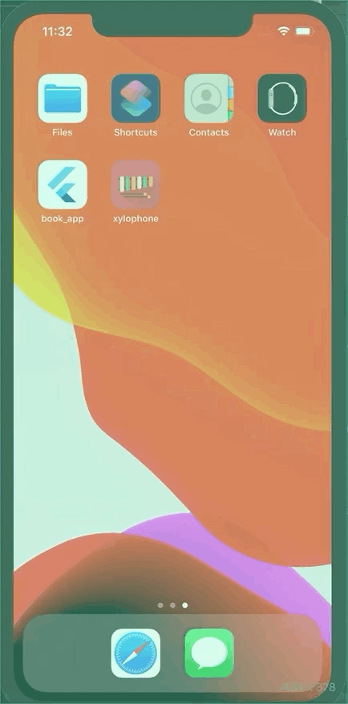

# Xylophone 

## A basic Xylophone app

`Tap on it to hear different sounds(Every row represents different sound)`

For help getting started with Flutter, view the online [documentation](https://flutter.dev).

You can check out the corresponding Google code lab [here](https://codelabs.developers.google.com/codelabs/flutter/index.html?index=..%2F..%2Findex#0).

# Demo



# Getting Started

**Note:** Make sure your Flutter environment is setup & if not installed then [Click here to install](https://flutter.dev/docs/get-started/install)

**Installation**

In the command terminal, run the following commands:

```
$ git clone https://github.com/khan-rehan/Xylophone.git

$ cd Xylophone/

$ flutter run
```

# Simulate for iOS

## Method One

```
Open the project in Xcode from ios/Runner.xcodeproj.
Hit the play button.
```

## Method Two

```
Run the following command in your terminal.
$ open -a Simulator
$ flutter run
```

# Simulate for Android

```
Make sure you have an Android emulator installed and running.
Run the following command in your terminal.
$ flutter run
```

